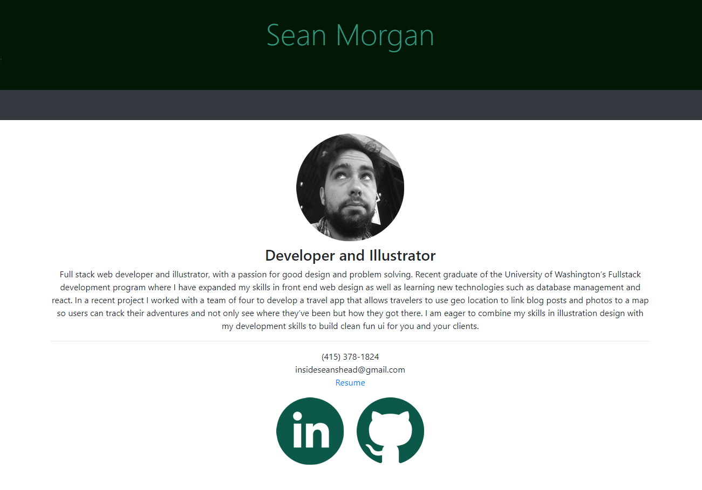

# React Portfolio

## Description
    
As I continue to develop my skills I need a website that can show off those skills to potential clients. I have come a long way in the last few months so thought it was time to update my portfolio to show that off. Utilizing react and bootstrap I have made a new home for my current and future development projects.

## Table of Contents
1. [Installation](#installation)
1. [Usage](#usage)
1. [License](#license)
1. [Questions](#questions)

## Deployed Site
    
https://seanmorgandesigns.com/
    

## License
    
MIT
    
## Questions

Github: insideseanshead
email: insideseanshead@gmail.com